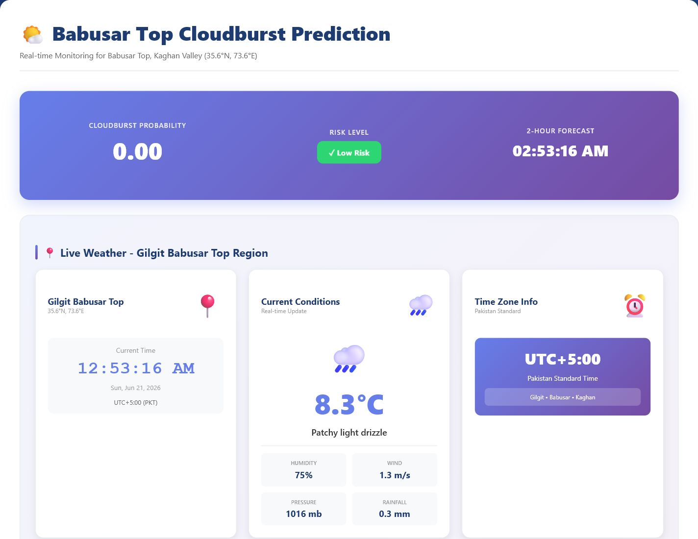

# Babusar Top Cloudburst Prediction



This project serves a trained **BiLSTM cloudburst prediction model** through a Flask backend and a live dashboard for **Babusar Top, Kaghan Valley**.

## What It Does

- Predicts cloudburst probability using a saved BiLSTM model.
- Displays risk level on a real-time dashboard.
- Shows live weather cards, map, forecast cards, and alerts.
- Uses saved model artifacts: `cloudburst_final_bilstm_only.keras`, `scaler_final.pkl`, and `feature_cols.pkl`.

## Quick Start

Install dependencies:

```bash
python -m pip install -r requirements.txt
```

Optional: set an API key for authenticated endpoints:

```bash
set API_KEY=your-secret-key
```

Run the server:

```bash
python app.py
```

Open the dashboard:

```text
http://127.0.0.1:5000
```

## Endpoints

- `GET /` - Dashboard served from `templates/index.html`.
- `GET /api/health` - Server health check.
- `GET /api/prediction` - Quick placeholder forecast.
- `POST /api/predict` - Direct feature-array prediction.
- `POST /api/predict_live` - Main authenticated live prediction endpoint.

## Main Files

| File | Purpose |
|---|---|
| `app.py` | Flask backend and prediction API |
| `templates/index.html` | Dashboard frontend |
| `cloudburst_final_bilstm_only.keras` | Trained BiLSTM model |
| `scaler_final.pkl` | Saved feature scaler |
| `feature_cols.pkl` | Saved feature order |
| `code.txt` | Training pipeline export |
| `Babusar_Top.png` | Correct dashboard screenshot |

## Notes

- The project requires TensorFlow to run the model.
- Keep API keys in environment variables, not in committed code.
- The included `.venv` folder is intentionally ignored and should be recreated locally.
